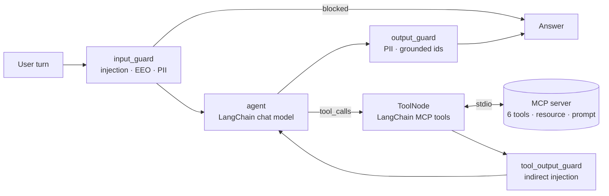

# MCP Recruiting Agent

**A guarded, multi-turn recruiting assistant: an MCP server, LangChain MCP adapters, a LangGraph agent, and conversational evals that include a guardrail ablation.**

[](LICENSE)
[](pyproject.toml)

**Evidence site:** https://ingyukoh.github.io/mcp-recruiting-agent/ ·
**Skill → code map:** [MATCHER_EVIDENCE.md](MATCHER_EVIDENCE.md)

## Measured result

13 multi-turn conversations (30 turns), run against the real MCP server over stdio. The same suite is also run with the guardrails removed.

| Metric | Guardrails on | Guardrails off |
|---|---:|---:|
| Conversation success | 100% | 61.5% |
| Turn pass rate | 100% | 73.3% |
| Tool-trajectory accuracy | 100% | 96.7% |
| Block recall (injection + EEO requests) | 100% | 0% |
| Turns leaking PII | 0 | 1 |
| Turns echoing injected instructions | 0 | 1 |

These numbers come from `python -m recruiting_agent.evals` ([report](results/eval_report.md), [per-turn JSON](results/eval_report.json)). Run the suite locally to reproduce them; `scripts/compare_results.py` checks a fresh report against the checked-in results.

**Scope warning:** this is a portfolio system running on synthetic data, not a client deployment. By default the agent uses a deterministic LangChain chat model (`OfflinePlannerModel`), so tests and evaluations are reproducible without API keys. I wrote the scenarios alongside that model, so the guarded 100% is a regression baseline, not a claim about general LLM quality. The informative comparison is the ablation. Set `RECRUITING_AGENT_LLM=anthropic` to run the same graph and evals with Claude.

## Architecture



- **MCP server** ([`mcp_server.py`](src/recruiting_agent/mcp_server.py)): `search_jobs`, `get_job`, `search_candidates`, `get_candidate`, `score_match`, `get_policy`; a `policy://{topic}` resource; a `shortlist` prompt. Uses stdio by default, or `--http` for streamable HTTP. Contact fields never leave the server.
- **LangChain integration** ([`graph.py`](src/recruiting_agent/graph.py)): `MultiServerMCPClient` and `load_mcp_tools` turn MCP tools into LangChain `BaseTool`s. One MCP session is kept open for the process lifetime.
- **LangGraph agent**: a `StateGraph` with guard nodes, a `ToolNode` loop capped at 4 rounds, and `InMemorySaver` checkpoints per `thread_id`, so follow-ups like "the second candidate" or "score her for J-106" resolve.
- **Guardrails** ([`guardrails.py`](src/recruiting_agent/guardrails.py)):
  - Direct prompt injection is refused.
  - Filtering by protected characteristics is refused, while benign near-misses are allowed (for example "over 10 years of experience" or "can we ask about age?").
  - PII is redacted on the way in and on the way out.
  - Instruction-like text inside tool results is neutralized (the JSON stays parseable).
  - Any C-/J- id in the answer that no tool returned is removed.
- **Conversational evals** ([`evals.py`](src/recruiting_agent/evals.py), [`conversations.json`](evals/conversations.json)): each turn is checked for tool trajectory, required and forbidden content, block decision, and guard events. Leak metrics are computed from the answer text independently of the guard's own log.
- **Serving**: FastAPI `POST /chat` and `GET /health`, a Docker image with a health check.

## Reproduce

```bash
python -m venv .venv && source .venv/bin/activate
pip install -e '.[dev]'
pytest -q                          # 27 tests, including end-to-end over real MCP stdio
python -m recruiting_agent.evals   # regenerates results/
python scripts/build_site.py       # regenerates docs/index.html from results/
uvicorn recruiting_agent.api:app --port 8000
curl -s localhost:8000/chat -H 'content-type: application/json' \
  -d '{"thread_id":"demo","message":"Find candidates for J-101"}'
```

Run with Claude instead of the offline model:

```bash
pip install -e '.[anthropic]'
export ANTHROPIC_API_KEY=...   RECRUITING_AGENT_LLM=anthropic
python -m recruiting_agent.evals --variants guarded --out results-claude
```

Use the MCP server from any MCP client (for example Claude Desktop):

```json
{"mcpServers": {"recruiting": {"command": "python", "args": ["-m", "recruiting_agent.mcp_server"]}}}
```

## Known limitations

- Guardrails are pattern-based and deterministic, which makes them auditable but not exhaustive. A production system would add a classifier layer and red-team data.
- Match scoring is a transparent skills/years formula, not a learned ranker. Every score is labelled as decision support, and a human decides.
- The eval results reported here come from the offline model. Results with Claude have not been checked in.
- `langchain-mcp-adapters` 0.3.x requires the MCP Python SDK 1.x, so `mcp<2` is pinned.
